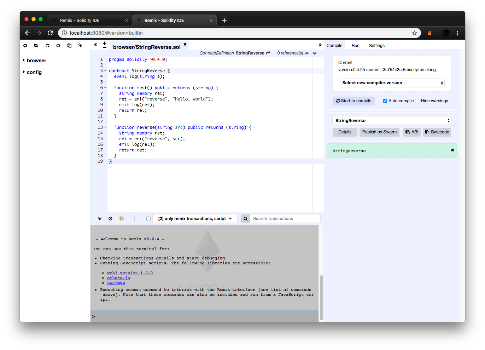
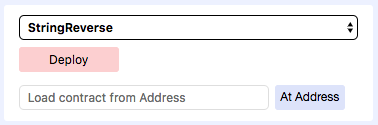
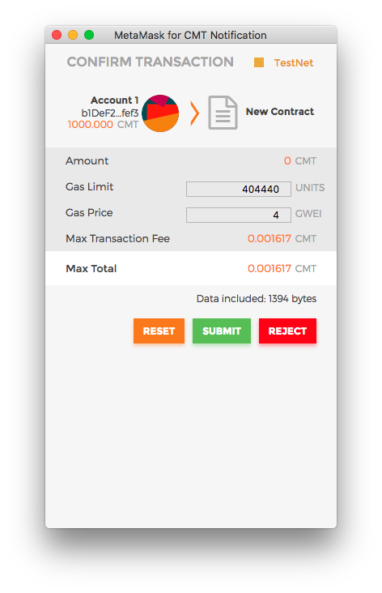
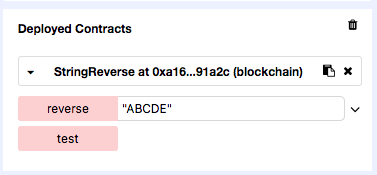
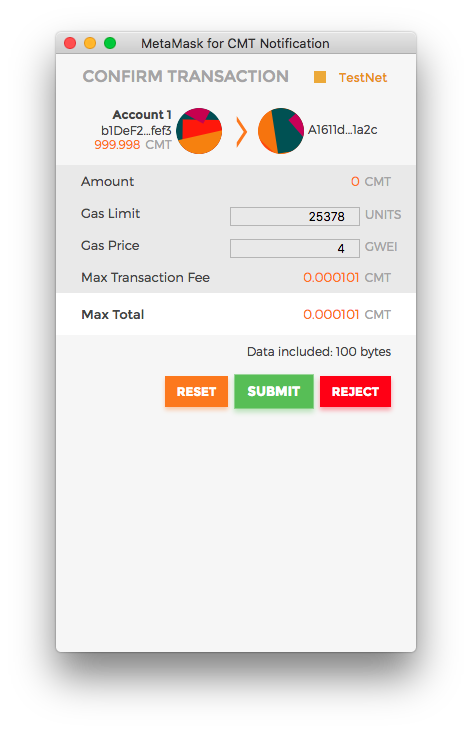
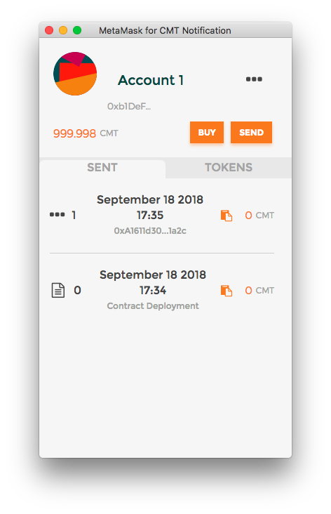
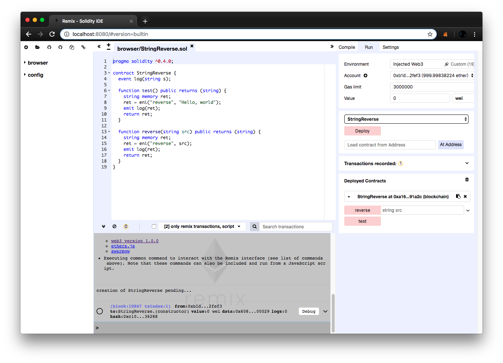
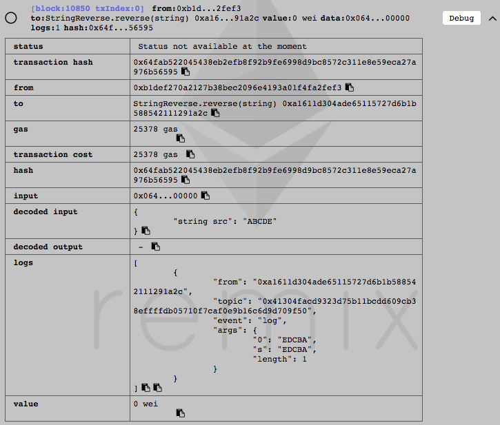

Integrate CyberMiles Remix & MetaMask
=====================================

.. _integrate-cybermiles-remix-metamask:

Install CyberMiles MetaMask Chrome extension
--------------------------------------------

- Download chrome.crx from https://github.com/CyberMiles/travis-extension/blob/travis/dist/chrome.crx
- Install chrome.crx (Go to chrome://extensions/ and drag the chrome.crx extension file to extension page)
- Open MetaMask to initialize CMT account
- Switch to **Test Network**

.. image:: _static/images/remix-metamask/test-network.png
   :align: center

- Get some CMT at http://travis-faucet.cybermiles.io/cn/

Run Remix IDE
-------------

.. code:: bash

  git clone https://github.com/CyberMiles/remix-ide.git
  cd remix-ide
  npm install
  npm run setupremix
  npm start

- It will run Remix IDE on default port 8080

Using MetaMask in Remix IDE
---------------------------

- Check Remix IDE at http://localhost:8080
- Turn on `Auto compile` option

- Go to run tab at right panel and select `Injected Web3` as Environment)
- Use `StringReverse.sol` as example

.. code:: bash

  pragma solidity ^0.4.0;

  contract StringReverse {
    event log(string s);

    function test() public returns (string) {
      string memory ret;
      ret = eni("reverse", "Hello, world");
      emit log(ret);
      return ret;
    }

    function reverse(string src) public returns (string) {
      string memory ret;
      ret = eni("reverse", src);
      emit log(ret);
      return ret;
    }
  }

- Click red `Deploy` button to deploy contract

- Submit create contract transaction in MetaMask

- Now we try to submit `reverse("ABCDE")` function call (click red `reverse` button to submit)

- Submit reverse call transaction in MetaMask

- Check result in Remix IDE console

